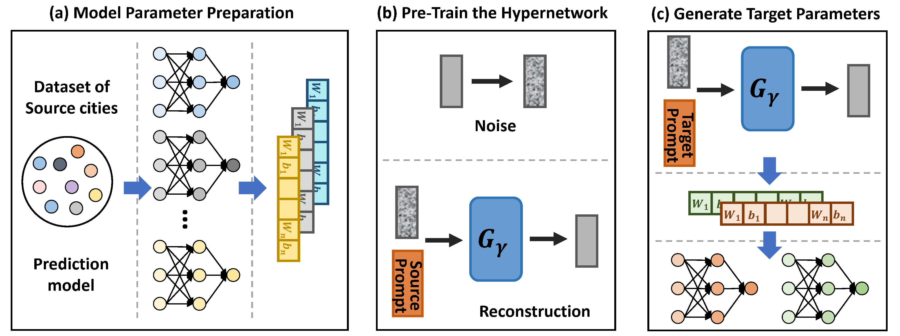

# A Generative Pre-Training Framework for Spatio-Temporal Graph Transfer Learning


## Requirements
- accelerate==0.23.0
- einops==0.7.0
- ema_pytorch==0.2.3
- matplotlib==3.5.3
- numpy==1.23.2
- PyYAML==6.0.1
- PyYAML==6.0.1
- scikit_learn==1.1.2
- scipy==1.9.1
- torch==1.12.0+cu113
- torch_geometric==2.2.0
- torchsummary==1.5.1
- tqdm==4.64.0
- xlrd==2.0.1
- xlwt==1.3.0

## Model training & Evaluating
- We integrate the zeroshot evaluation module into the diffusion.
- Args Optional parameters：
  - expIndex：Assign a special number to the experiment.
  - targetDataset: The target dataset, can be selected from ['DC', 'BM', 'man', 'metr-la', 'pemes-bay', 'shenzhen', 'chengdu_m'].
  - modeldim: Transformer hidden dim.
  - epochs: Number of batches in diffusion learning.
  - diffusionstep: Steps of diffusion.
  - basemodel: can select from ['v_STGCN5', 'v_GWN'].
  - denoise model: Several implementations of transformer, the main difference between them is the use of conditions. Can be selected from ['Trans1', 'Trans2', 'Trans3', 'Trans4', 'Trans5'].
    - Trans1: Ordinary transformer, the kg embedding is added to the parameter section associated with the space.
    - Trans2: Conditions are added to each layer of transformer.
    - Trans3: After the conditions are aggregated, they are added to each layer of transformer.
    - Trans4: Cross attention.
    - Trans5: Adaptive LayerNorm.
```bash
CUDA_VISIBLE_DEVICES=3 python 1Dmain.py --expIndex 140 --targetDataset metr-la --modeldim 512 --epochs 80000 --diffusionstep 500 --basemodel v_GWN  --denoise Trans1
